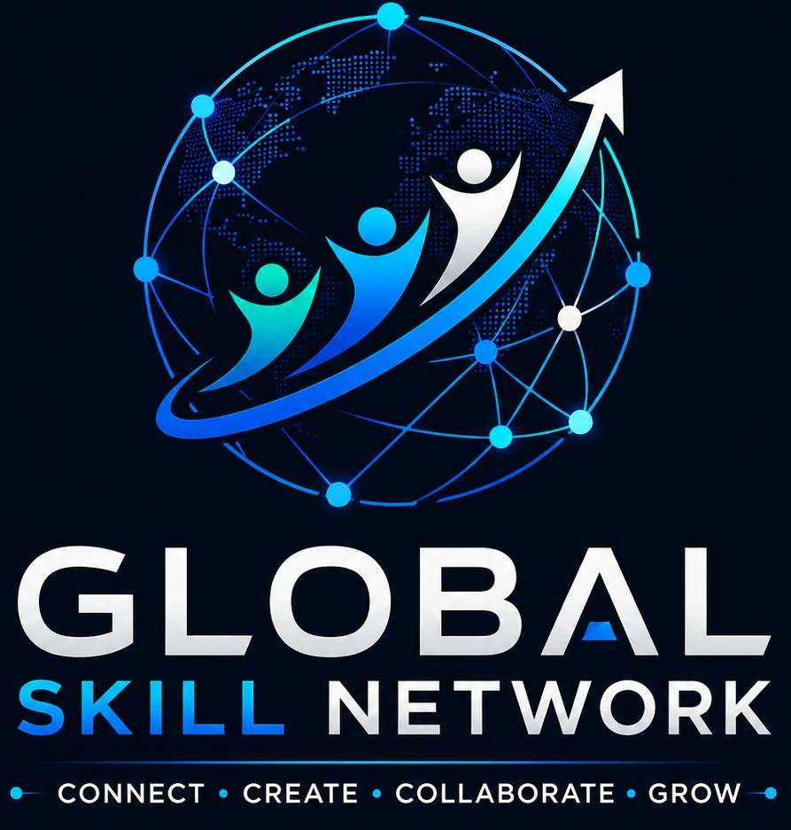

# 🌍 Global Skill Network

> A global platform connecting skilled people, developers, creators, and teams to build projects, discover opportunities, collaborate, and grow together.

## 🚀 About

Global Skill Network is a full-stack platform designed to connect talented people from around the world.

Users will be able to:

- 👤 Create professional profiles
- 🧠 Showcase their skills
- 💻 Share and discover projects
- 🤝 Find collaborators and teams
- 🌍 Connect with people internationally
- 🎯 Discover opportunities
- 💬 Communicate with other users
- 📊 Build a professional network

The goal is to create a modern global ecosystem where skills, ideas, projects, and opportunities can connect.

---

## ✨ Features

### 🔐 Authentication

- User registration
- Secure login
- Password hashing with bcrypt
- JWT authentication
- Protected API routes

### 👤 User Profiles

- Full name
- Email
- Skills
- Biography
- Projects
- Professional information

### 💻 Projects

Users will be able to:

- Create projects
- Discover projects
- Join projects
- Find collaborators
- Build teams

### 🌎 Global Networking

Connect with:

- Developers
- Designers
- Creators
- Entrepreneurs
- Students
- Freelancers
- Teams

### 🎯 Opportunities

The platform will support discovery of:

- Jobs
- Freelance opportunities
- Projects
- Scholarships
- Collaborations
- Internships

---

## 🏗️ Project Structure

```text
global-skill-network/
│
├── frontend/
│   ├── index.html
│   ├── register.html
│   ├── login.html
│   ├── style.css
│   └── script.js
│
├── backend/
│   ├── package.json
│   ├── server.js
│   ├── db.js
│   ├── schema.sql
│   └── .env.example
│
├── .gitignore
│
└── README.md

🎯 Vision
Our vision is to build a global platform where talent is not limited by geography.
Skills should create opportunities, and opportunities should connect people.
🤝 Contributing
Contributions, ideas, and feedback are welcome.
If you want to contribute:
Fork the repository
Create a new branch
Make your changes
Commit your changes
Open a Pull Request
📄 License
This project is currently under development.
License information will be added before the first public production release.
👨‍💻 Author
Agegnehu Shibiru
Global Skill Network
⭐ Project Status
🚧 Active Development
This project is currently being developed step by step from frontend to a complete full-stack international platform.


### https://agegnehu2.github.io/global-skill-network/
